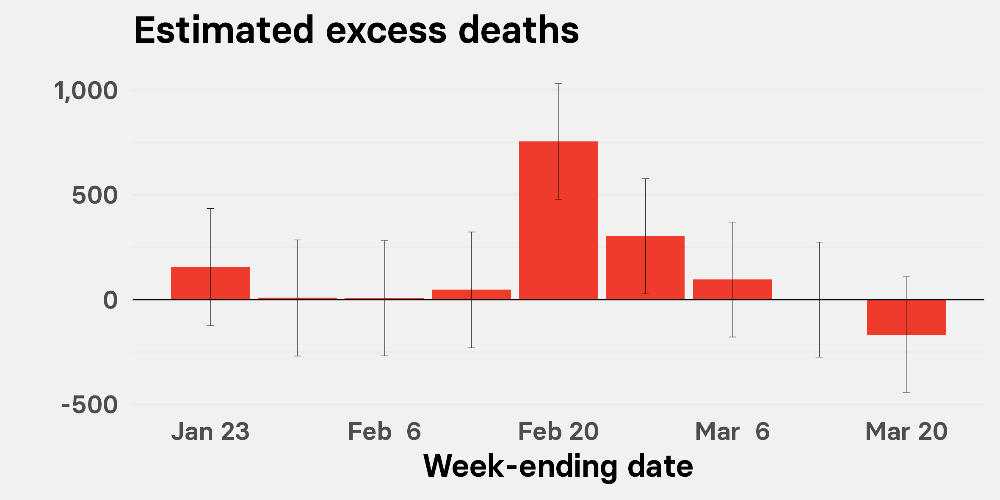
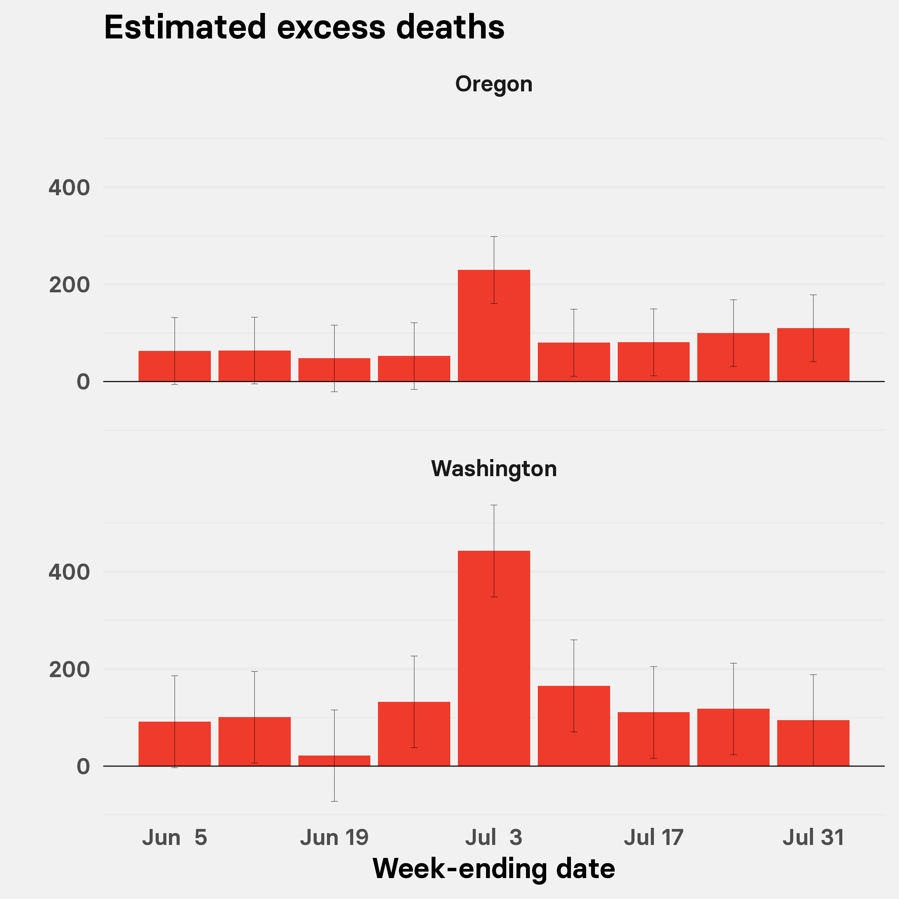

```{r setup, include=FALSE}
knitr::opts_chunk$set(echo = TRUE, warning = FALSE, results = FALSE, message = FALSE)
```

Data and [R](https://www.r-project.org/) code to reproduce the analysis underlying [this Dec. 28, 2021 BuzzFeed News article](https://www.buzzfeednews.com/article/peteraldhous/extreme-weather-climate-change-missing-deaths), calculating excess deaths associated with the June/July Pacific Northwest heat wave, and updating our [earlier analysis](https://buzzfeednews.github.io/2021-05-tx-winter-storm-deaths/) for excess deaths during the February winter storm and power outages in Texas.

### Data and setting up

The CDC maintains counts of weekly deaths, for all and certain selected causes, at the national and state level (also for New York City, Washington, DC, and Puerto Rico), for [2014 to 2019](https://data.cdc.gov/NCHS/Weekly-Counts-of-Deaths-by-State-and-Select-Causes/3yf8-kanr), and for [2020 and 2021](https://data.cdc.gov/NCHS/Weekly-Counts-of-Deaths-by-State-and-Select-Causes/muzy-jte6). This analysis uses a snapshot of that data captured on Dec 22 2021, saved in a single CSV file.

```{r}
# load required packages
library(tidyverse)
library(scales)
library(splines)
library(lubridate)

# set system date to UTC
Sys.setenv(TZ="UTC")

# load weekly deaths data
mortality <- read.csv("data/mortality.csv", stringsAsFactors = F) %>%
  mutate(weekendingdate = as.Date(weekendingdate))
```

### Calculating expected deaths

To estimate expected deaths for each jurisdiction and week, we trained models on the 2015-2019 weekly deaths data, accounting for long-term demographic changes using a linear component and using a smoothing spline to account for seasonal variation, as for our previous analysis of deaths in the February Texas winter storm.

```{r}
# data frame to hold observed and expected deaths data
mortality_working <- tibble()

# fit models and predict expected deaths
for (j in unique(mortality$jurisdiction)) {
  tmp1 <- mortality %>%
    filter(jurisdiction == j & weekendingdate < "2020-01-01")
  model <- lm(allcause ~ weekendingdate + bs(mmwrweek, knots = quantile(mmwrweek, seq(0, 1, 0.1))), data = tmp1)
  tmp2 <- mortality %>%
    filter(jurisdiction == j & weekendingdate >= "2020-01-01")
  tmp <- bind_rows(tmp1,tmp2)
  tmp3 <- as_tibble(predict(model,tmp, interval = "prediction"))
  tmp <- bind_cols(tmp,tmp3)
  mortality_working <- bind_rows(mortality_working,tmp)
}

# clean up environment
rm(tmp1,tmp2,tmp3,tmp,model,j)
```

Not surprisingly, the models performed better in states with larger populations. For example, the model for Texas accounted for about 77% of variation in weekly death counts; for Washington the figure was 66%, and for Oregon 53%.

### Calculating weekly death anomalies

We calculated overall weekly death anomalies and anomalies minus deaths for which COVID-19 was given as the underlying cause.

```{r}
# calculate death anomalies; all causes and excluding COVID-19 deaths
mortality_working <- mortality_working %>%
  mutate(deaths_anomaly = allcause - fit,
         deaths_anomaly_upr = allcause - lwr,
         deaths_anomaly_lwr = allcause - upr,
         non_covid_deaths_anomaly = deaths_anomaly - covid_19_u071_underlying_cause_of_death,
         non_covid_deaths_anomaly_upr = deaths_anomaly_upr - covid_19_u071_underlying_cause_of_death,
         non_covid_deaths_anomaly_lwr = deaths_anomaly_lwr - covid_19_u071_underlying_cause_of_death)
```

### Excess non COVID-19 deaths in the weeks surrounding the winter storm in Texas

We filtered the data for Texas, and for weeks in 2021 surrounding the the February winter storm, updating our previous analysis.

```{r}
texas_freeze <- mortality_working %>%
  filter(weekendingdate > "2021-01-16" & weekendingdate <= "2021-03-20" & jurisdiction == "Texas") %>%
  mutate(weekendingdate = as.Date(weekendingdate))

breaks <- as.Date(c("2021-01-23","2021-02-06","2021-02-20","2021-03-06","2021-03-20"))

plot <- ggplot(texas_freeze, aes(x = weekendingdate, y = non_covid_deaths_anomaly)) +
  geom_col(fill = "#ef3b2c") +
  geom_errorbar(aes(x = weekendingdate,
                    ymin = non_covid_deaths_anomaly_lwr,
                    ymax = non_covid_deaths_anomaly_upr),
                size = 0.1,
                width = 0.6) +
  geom_hline(yintercept = 0, size = 0.3) +
  xlab("Week-ending date") +
  ylab("") +
  ggtitle("Estimated excess deaths") +
  scale_x_date(date_labels = "%b %e", breaks = breaks) +
  scale_y_continuous(labels = comma) +
  theme_minimal(base_family = "Basier Square SemiBold", base_size = 18) +
  theme(panel.background = element_rect(fill = "#f1f1f2", size = 0),
        plot.background = element_rect(fill = "#f1f1f2", size = 0),
        panel.grid.major.x = element_blank(),
        panel.grid.minor.x = element_blank())
ggsave("img/texas_freeze.png", plot, width = 20, height = 10, units = "cm")

```



This chart shows the weekly death anomalies from causes other than COVID-19, with error bars based on the 95% confidence intervals for each expected deaths prediction. It shows a significant spike in non-COVID deaths in Texas in the week ending Feb. 20, immediately following the winter storm and when the power outages occurred, that greatly exceeds the [official tally](https://web.archive.org/web/20211201152342/https://www.dshs.texas.gov/news/updates.shtm) of storm-related deaths being put together by the Texas Department of State Health Services -- which now stands at 210. Our best estimate is that 755 excess deaths occurred in Texas in the week ending Feb. 20 alone, with a range of uncertainty from 479 to 1,031.

### Excess non COVID-19 deaths in the weeks surrounding the heat wave in Oregon and Washington

We filtered the data for Oregon and Washington, and for weeks in June and July 2021 surrounding the height of the Pacific Northwest heat wave.

```{r}
pacnw_heat_wave <- mortality_working %>%
  filter(weekendingdate >= "2021-06-05" & weekendingdate <= "2021-07-31" & (jurisdiction == "Washington" | jurisdiction == "Oregon")) %>%
  mutate(weekendingdate = as.Date(weekendingdate))

breaks <- as.Date(c("2021-06-05","2021-06-19","2021-07-03","2021-07-17","2021-07-31"))

plot <- ggplot(pacnw_heat_wave, aes(x = weekendingdate, y = non_covid_deaths_anomaly)) +
  geom_col(fill = "#ef3b2c") +
  geom_errorbar(aes(x = weekendingdate,
                    ymin = non_covid_deaths_anomaly_lwr,
                    ymax = non_covid_deaths_anomaly_upr),
                size = 0.1,
                width = 0.6) +
  geom_hline(yintercept = 0, size = 0.3) +
  xlab("Week-ending date") +
  ylab("") +
  ggtitle("Estimated excess deaths") +
  facet_wrap(~jurisdiction, ncol = 1) +
  scale_x_date(date_labels = "%b %e", breaks = breaks) +
  theme_minimal(base_family = "Basier Square SemiBold", base_size = 18) +
  theme(panel.background = element_rect(fill = "#f1f1f2", size = 0),
        plot.background = element_rect(fill = "#f1f1f2", size = 0),
        panel.grid.major.x = element_blank(),
        panel.grid.minor.x = element_blank())
ggsave("img/pacnw_hw.png", plot, width = 20, height = 20, units = "cm")

```



This chart reveals a significant spike in non-COVID deaths in Washington and Oregon in the week ending July 3, at the height of the Pacific Northwest heat wave. Our best estimate is that 443 excess deaths occurred in Washington in this week alone, with a range of uncertainty from 348 to 537. Our best estimate for Oregon in this week is 229 excess deaths, with a range of uncertainty from 160 to 298. The official counts from the states for heat wave deaths are currently [119 between June 26 and July 2](https://www.doh.wa.gov/Emergencies/BePreparedBeSafe/SevereWeatherandNaturalDisasters/HotWeatherSafety/HeatWave2021#heading88455) for Washington and [96](https://www.opb.org/pdf/OREGON_heat_deaths_revised_1628632311939.pdf) for Oregon.

### Oregon and Washington deaths by week and cause

Next we looked at specific causes of death to see if any particular causes seemed to account for the spike in deaths seen in Oregon and Washington in the week ending July 3.

```{r}
causes <- mortality_working %>%
  filter(weekendingdate <= "2021-10-09" & grepl("Washington|Oregon",jurisdiction)) %>%
  select(jurisdiction, weekendingdate, mmwrweek, 5:17, 32, 35) %>%
  pivot_longer(cols = c(4:18), names_to = "cause", values_to = "deaths") %>%
  # some cleaning and processing of data
  mutate(cause = gsub("_"," ",cause),
         cause = str_squish(gsub("\\w*[0-9]+\\w*\\s*", "", cause)),
         cause = gsub("other diseases of respiratory","other respiratory", cause),
         cause = gsub("symptoms signs and abnormal","other", cause),
         cause = gsub("naturalcause","natural cause", cause),
         cause = gsub("allcause","all cause", cause),
         weekendingdate = as.Date(weekendingdate),
         year = as.character(year(weekendingdate)),
         plot_year = case_when(year == "2021" ~ "2021",
                               year == "2020" ~ "2020",
                               TRUE ~ "Previous years"),
         plot_date = ymd(paste("2020",month(weekendingdate),day(weekendingdate))))

for (c in unique(causes$cause)) {
    tmp <- causes%>%
      filter(cause == c)
    plot <- ggplot(tmp, aes(x = plot_date, y = deaths, group = year, color = plot_year)) +
      geom_line() +
      geom_point() +
      scale_y_continuous(labels = comma) +
      scale_x_date(date_labels = "%b") +
      scale_color_manual(values = c("#686868","#ef3b2c","#cccccc"), name = "") +
      theme_minimal(base_family = "Basier Square SemiBold", base_size = 18) +
      theme(panel.background = element_rect(fill = "#f1f1f2", size = 0),
            plot.background = element_rect(fill = "#f1f1f2", size = 0),
            legend.position = "top") +
      ylab("Deaths") +
      xlab("") +
      facet_wrap(~jurisdiction, ncol = 1)
    ggsave(paste0("causes/",c,".png"), plot, width = 20, height = 20, units = "cm")
  }
```

There were no obvious spikes for the causes logged in the CDC mortality data for Oregon, but two causes of death stood out as having spiked in Washington in the week ending July 3:

### Cardiovascular disease


<br>

### Diabetes


<br>

This pattern for Washington resembled what we observed in Texas for the winter storm. It suggests that the heat wave killed many people in Washington who were already medically vulnerable, whose deaths were attributed to their underlying conditions.
